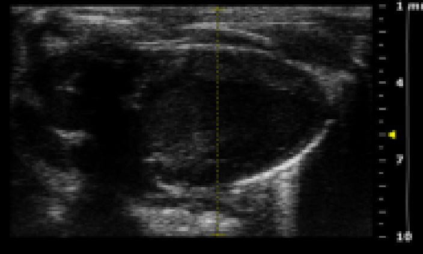
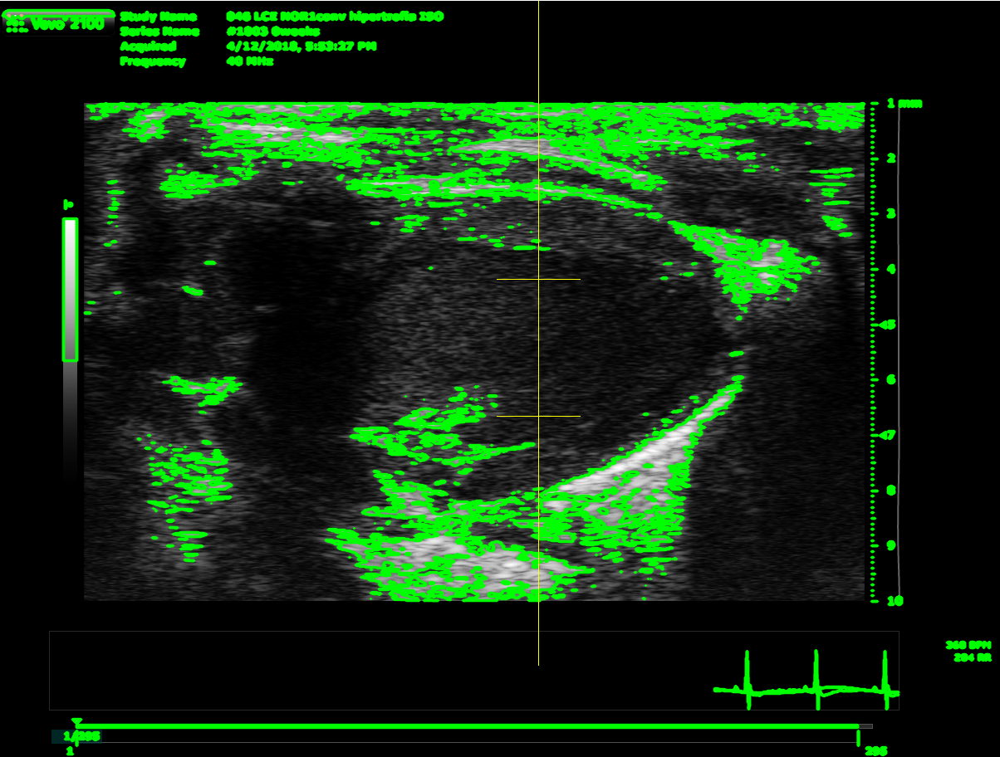
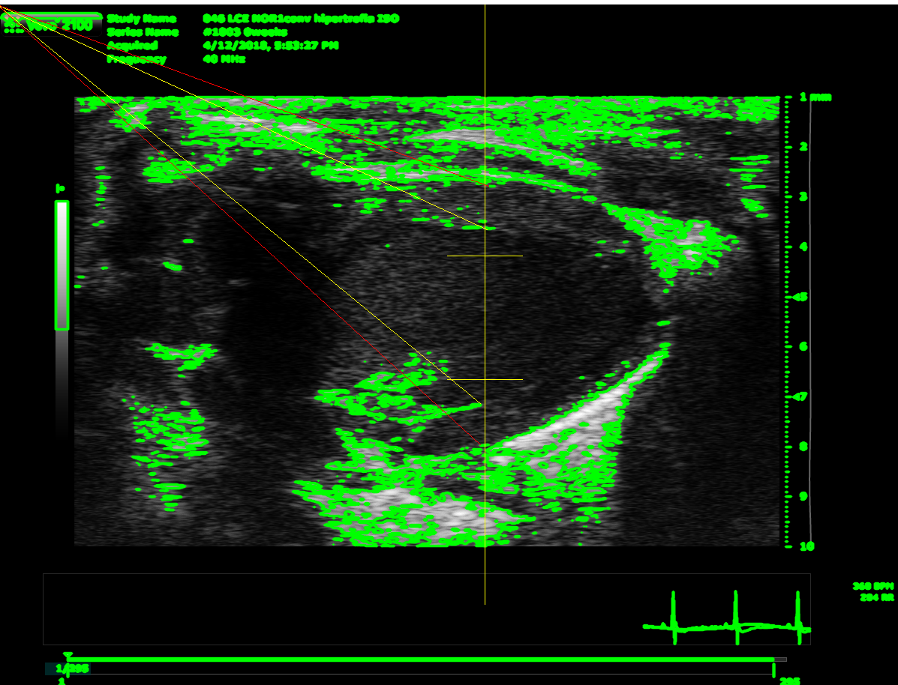

## "Cor al pit" challenge project for the hackathon bitsxlaMarató 

Done with love by

## TEAM MEMBERS

| Name           | GitHub username |
|----------------|-----------------|
| Alex Moa       | Bagansio        | 
| Cristian Mesa  |     CristianMesaSanchez    | 
| Artur Farriols | arturfarriols        |

## HOW IT WORKS

When a DICOM file is load the program analyze the ecography.

We get that image and we add some noise to create the contours:

After that we apply an algorithm to identify the needed heart points to calculate the variables:

Also we are using Tesseract to obtain the beats per minute
